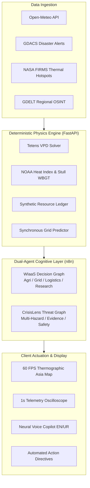
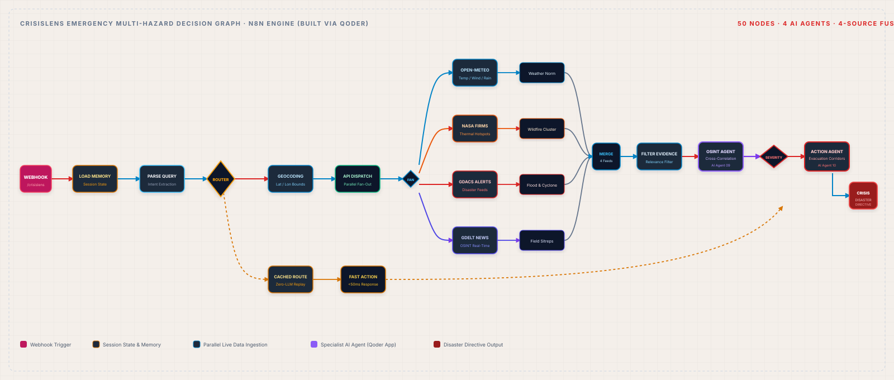

# WIaaS
## Global Climate Intelligence Platform


---

## 🌍 Mission

**WIaaS** is a global climate resilience and weather intelligence platform designed to help operators, planners, and field teams turn environmental signals into fast, evidence-based action.

Built for a broad set of climate stress scenarios, the system combines atmospheric physics, regional baselines, telemetry, and specialist decision support to support agriculture, infrastructure, logistics, and emergency response across multiple geographies and operating contexts.

## About Us

WIaaS combines live weather telemetry, deterministic climate physics, and region-aware specialist agents to turn environmental signals into practical decisions for agriculture, infrastructure, logistics, and emergency response.

<video src="https://github.com/user-attachments/assets/06da3cad-279a-49ed-9f65-b70e9725cb15" controls="controls" preload="metadata" width="100%">
  Your browser does not support inline video.
</video>

---

## 🎯 The Operational Problem & The WIaaS Solution

### The Problem
Traditional weather applications often provide passive forecasts without translating them into operational impact. When agricultural crops face stress, power systems are pushed to peak demand, or transport and water systems become vulnerable to extreme events, manual interpretation is too slow.

### The Solution
WIaaS bridges the operational gap by coupling **deterministic atmospheric physics** with an **autonomous dual-agent decision layer**. It answers:
- **What physical stress is occurring?** (Vapor pressure deficit, wet-bulb survivability, heat index).
- **What critical resources are degrading?** (Water storage, power headroom, fuel reserves).
- **What action must be taken now?** (Irrigation timing, grid management, flood responses, public safety guidance).

---

## ⚡ Quickstart & 1-Click Launch

The frontend application is **pre-compiled and served directly** by the FastAPI backend. The platform can be run with Python 3.10+ without requiring a Node.js install for standard evaluation and local testing.

### Option A: 1-Click Startup Scripts
- **Windows:** Double-click [`start.bat`](start.bat) or run in PowerShell:
  ```powershell
  .\start.bat
  ```
- **macOS / Linux:** Run in terminal:
  ```bash
  chmod +x start.sh && ./start.sh
  ```

### Option B: Standard Python Launch
1. **Clone the Repository:**
   ```bash
   git clone https://github.com/Prince637-boo/-Weather-Intelligence-as-a-Service-WIaaS-
   cd -Weather-Intelligence-as-a-Service-WIaaS-
   ```

2. **Install Python Dependencies:**
   ```bash
   pip install -r requirements.txt
   ```

3. **Start the Platform:**
   ```bash
   python run.py
   ```

4. **Access in Browser:**
   - 🌐 **Interactive Dashboard & Map:** [http://127.0.0.1:8000](http://127.0.0.1:8000)
   - 📚 **Swagger API Documentation:** [http://127.0.0.1:8000/docs](http://127.0.0.1:8000/docs)
   - 🧪 **CrisisLens Multi-Hazard Threat Panel:** Integrated in the UI header

---

## 🧪 Automated Verification Suite

The platform includes an automated end-to-end intelligence verification script testing all **12 CrisisLens specialized query categories** across multiple representative climate environments and operational baselines.

```bash
python scripts/verify_crisislens_questions.py
```

*Asserts: HTTP 200 responses, zero generic canned phrases, evidence-backed physics reasoning (°C, kPa, MW, mm), and authentic bilingual Urdu script generation.*

The live dashboard exposes the remaining features directly: regional monitoring, physics intelligence, agriculture diagnostics, what-if simulation, grid and logistics views, research synthesis, location intelligence, crisis analysis, bilingual English/Urdu chat and voice advisory, timeline and telemetry visualizers, and local action advisories.

## 🔐 Public-repository security

- Runtime `.env` files are ignored by Git; only `.env.example` is versioned.
- Never commit API keys, webhook credentials, tokens, passwords, or private certificates.
- Before publishing, inspect the staged diff with `git diff --cached` and rotate any credential that was ever committed.

---

## 🌟 Key Platform Features

### 1. 60 FPS Thermographic Regional Map
- High-performance MapLibre GL engine replacing sluggish 3D globes.
- Multi-scale geographic zoom across diverse regional observatories and microclimates.
- Interactive thermal perception heatmaps, dynamic precipitation radar rings, and wind flow vectors.

### 2. Real-Time 1-Second Telemetry Oscilloscope
- Hardware-accelerated HTML5 `<canvas>` oscilloscope rendering smooth Catmull-Rom cubic splines.
- Real-time rolling analytics HUD: `MIN (25s)`, `ROLLING AVG`, `PEAK`, and `DRIFT (Δ/s)`.
- Adaptive color schemes: Cyan (VPD / Soil), Amber (Fuel / Logistics), Emerald (Grid Load), Purple (Temperature).

### 3. Dual-Agent Cognitive Swarm (Two n8n Decision Graphs)
- **WIaaS Agent (`n8n/exports/WIAAS-Asia.json`)**:
  Synthesizes agricultural diagnostics (Tetens VPD, crop transpiration stress, night irrigation shifts), power grid transformer thermal headroom, logistics corridors, and structured research summaries.
- **CrisisLens Agent (`n8n/exports/WIaaS-CrisisLens-Asia.json`)**:
  Multi-hazard early warning engine fusing Open-Meteo, GDACS disaster alerts, NASA FIRMS thermal hotspots, and GDELT regional risk feeds into actionable evacuation and public safety instructions.

### 4. Neural Bilingual Voice Copilot (English & Urdu)
- Low-latency neural speech generation via FastAPI `/api/v1/tts` using Edge Neural voices:
  - English: `en-US-JennyNeural`
  - Urdu: `ur-PK-UzmaNeural`
- Full UI synchronicity: Toggling language instantly switches chat history, system notifications, input placeholders, and Nastaliq typography with proper RTL alignment.

### 5. Deterministic Physics & Synthetic Resource Ledger
- **Tetens Saturation Equation**: $e_s(T) = 0.61078 \times \exp(17.27T / (T + 237.3))$
- **Vapor Pressure Deficit (VPD)**: $\text{VPD} = e_s(T) \times (1 - RH/100)$
- **Critical Wet-Bulb Limit**: Autonomous heat-shock protocol triggered when $T_{wb} \ge 35.0^\circ\text{C}$.
- **Grid Demand Surge Model**: Models $+2.8\%$ cooling demand surge per degree Celsius above baseline.

---

## 🏗️ Architecture & Decision Graphs



### WIaaS Workflow Architecture


### CrisisLens Threat Workflow Architecture


---

## 🗺️ Regional Coverage

The platform incorporates granular baselines and coordinates across multiple global operational zones and climate baselines:

| Subregion | Key Representative Territories | Microclimate Simulation Profile |
|:---|:---|:---|
| **South Asia** | Multan, Karachi, Lahore, Delhi, Dhaka, Sylhet | Arid heat dome, canal night-pumping, coastal humidity, monsoon flash flood |
| **East Asia** | Tokyo, Beijing, Shanghai, Seoul, Taipei | Typhoon wind-bracing, continental mulching, island microgrid storage |
| **Southeast Asia** | Jakarta, Bangkok, Manila, Ho Chi Minh City | Tropical convective storms, storm surge floodgates, maritime logistics |
| **Central Asia** | Almaty, Tashkent, Bishkek | Continental arid steppes, glacier-fed irrigation, sub-zero grid resilience |
| **West Asia (Middle East)** | Dubai, Riyadh, Doha, Muscat | Extreme hyper-arid heat, desalination reserve burn, peak HVAC load |

---

## 📂 Project Directory Structure

```text
WIaaS/
├── backend/                      # FastAPI Application & Simulation Engine
│   ├── app/
│   │   ├── api/v1/endpoints.py   # REST APIs (telemetry, grid, client-location, TTS)
│   │   ├── core/config.py        # Atmospheric constants, thresholds, baseline registry
│   │   ├── core/regions_registry.json # 67 Asian regional profiles & coordinates
│   │   ├── engines/analytics.py  # Tetens, VPD, wet-bulb, and anomaly scoring
│   │   ├── engines/ledger.py     # Synthetic Resource Ledger (water, power, fuel)
│   │   ├── schemas/analytics.py  # Pydantic validation schemas
│   │   ├── services/bridge.py    # Compressed state vector serialization
│   │   ├── services/grid_predictor.py # Zero-latency synchronous grid predictor
│   │   ├── services/pipeline.py  # 6-stage telemetry & cache pipeline orchestrator
│   │   └── main.py               # Server entry, CORS, static SPA mount, Edge TTS
│   ├── static/                   # Compiled Vite SPA production bundle (served at /)
│   ├── Dockerfile                # Container specification for backend
│   └── requirements.txt          # Python dependencies
│
├── frontend/                     # Vite Single Page Application Source
│   ├── src/
│   │   ├── asia-map.js           # 60 FPS MapLibre GL Thermographic Map engine
│   │   ├── asia-map-data.js      # GeoJSON boundaries & coordinate catalog
│   │   ├── dynamic-visualizer.js # 1-second dynamic HTML5 canvas oscilloscope
│   │   ├── chat.js               # Bilingual voice & conversational copilot
│   │   ├── ui.js                 # Unified navigation, drawers, and HUD widgets
│   │   ├── ui-agriculture.js     # Agro diagnostics, action directives, radar chart
│   │   ├── geo-navigation.js     # Country, province, and city navigation
│   │   ├── map-layers.js         # Thermal, wind vector, and rain radar overlays
│   │   └── styles/main.css       # Master design system & responsive layout
│   ├── index.html                # Application entry shell
│   ├── package.json              # Frontend dependencies (MapLibre, MorphIcons)
│   └── vite.config.js            # Bundler config targeting backend/static
│
├── n8n/                          # Multi-Agent Workflow Orchestration
│   └── exports/
│       ├── WIAAS-Asia.json       # WIaaS core decision graph
│       └── WIaaS-CrisisLens-Asia.json # CrisisLens multi-hazard threat graph
│
├── docs/                         # Technical Documentation
│   └── architecture.md           # Backend data pipeline & physics specification
│
├── scripts/                      # Operational Scripts & Test Suites
│   ├── update_n8n_asia_workflows.mjs # Synchronizes and patches n8n decision graphs
│   └── verify_crisislens_questions.py# Automated 12-question verification suite
│
├── assets/                       # Vector architecture diagrams (SVG)
│   ├── crisislens_workflow_architecture.svg
│   └── wiaas_workflow_architecture.svg
│
├── .env.example                  # Environment configuration template
├── AGENTS.md                     # Permanent memory & evolutionary log
├── SECURITY.md                   # Security protocols & input sanitization standards
├── SKILLS.md                     # Formula specifications & operational competencies
├── docker-compose.yml            # Multi-container orchestration (FastAPI + n8n)
├── requirements.txt              # Root Python dependencies
├── run.py                        # Unified 1-click Python launcher
├── start.bat                     # Windows 1-click launcher
└── start.sh                      # Unix/macOS 1-click launcher
```

---

## ⚙️ Environment Variables

Copy `.env.example` to `.env` to configure optional custom overrides:

```bash
# Server Configuration
HOST=0.0.0.0
PORT=8000
ENVIRONMENT=development
LOG_LEVEL=info

# n8n Webhook Endpoints
N8N_BASE_URL=http://localhost:5678
N8N_WEBHOOK_URL=https://abdxllxh2002.app.n8n.cloud/webhook/wiaas-asia-agents
N8N_CRISISLENS_WEBHOOK_URL=https://abdxllxh2002.app.n8n.cloud/webhook/wiaas-asia-crisislens
```

*(If external n8n webhooks are unreachable, WIAAS Asia automatically falls back to local deterministic physics intelligence with zero disruption to the user).*

---

## 💻 (Optional) Frontend Development with Hot Reloading

If you wish to edit the frontend code with instant Vite hot-module reloading:
```bash
cd frontend
npm install
npm run dev
```
The Vite development server runs on `http://localhost:5173` and automatically proxies all `/analytics` and `/api` requests to the FastAPI backend on port 8000.

To build the production bundle for FastAPI serving:
```bash
cd frontend
npm run build
```

---

## 🛡️ Current Limitations & Future Scope

### Current Limitations
1. **NASA FIRMS Hotspot Rate Limits**: Satellite active fire observations use open data endpoints; during global peak fire seasons, API response latencies may reach 1.5 seconds.
2. **Offline Mode**: While deterministic physical calculations operate 100% offline, real-time live telemetry requires an internet connection to reach Open-Meteo and GDACS feeds.

### Future Scope
1. **SCADA Substation Automated Actuation**: Establishing direct Modbus/DNP3 protocols for automated transformer cooling fan actuation and agricultural canal sluice gate triggers.
2. **Synthetic Aperture Radar (SAR) Ingestion**: Integrating Sentinel-1 SAR imagery for real-time flood extent mapping beneath heavy monsoonal cloud cover.
3. **Dedicated Edge Deployment**: Porting containerized ONNX physics models directly to regional edge gateways in off-grid agricultural basins.

---

## 📄 License
This project is licensed under the MIT License. See [`LICENSE`](LICENSE) for details.

